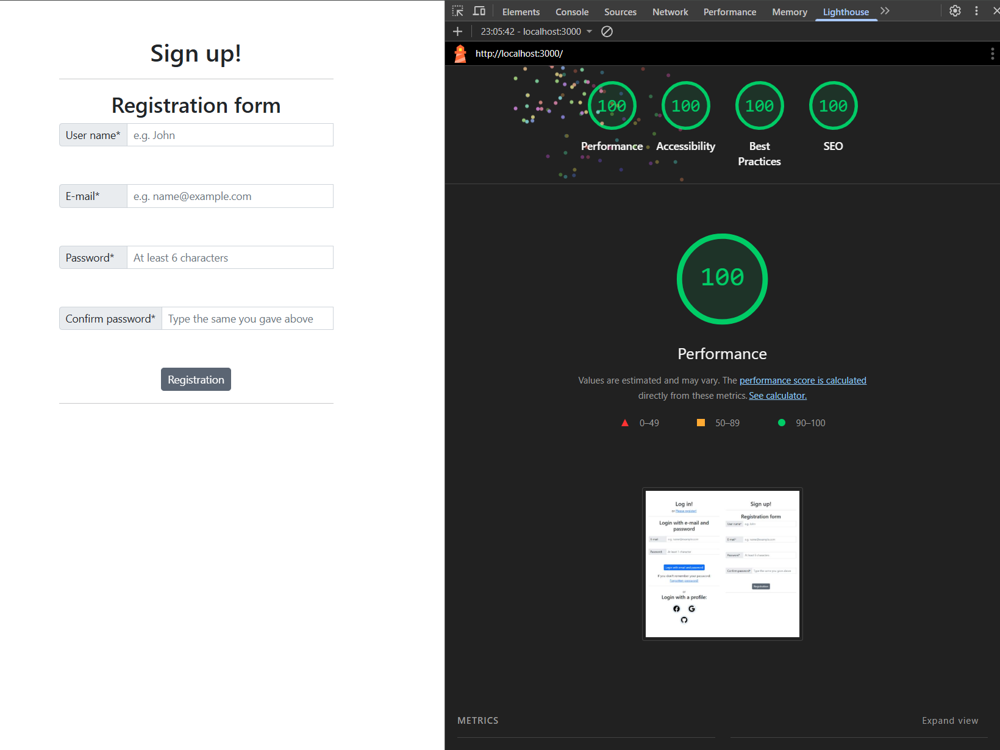

# Responsive Login & Registration Form

A frontend project built with HTML, CSS, Bootstrap, and JavaScript. Initially developed as a student assignment to
implement responsive login and registration forms with client-side validation. Later refactored using Webpack, tested
with Jest, and enhanced based on accessibility and performance audits.

## 🔍 Meta Description

Frontend project built with HTML, CSS, Bootstrap, and JavaScript. Refactored with Webpack for modular development,
integrated unit tests using Jest, and enhanced accessibility based on audit results. Demonstrates modern web development
practices.

## 📸 Screenshots




## 🚀 Features

- Responsive login & registration form layout using Bootstrap Grid
- Social login buttons: Google, Facebook, GitHub
- Client-side validation with JavaScript:
    - Name: at least 3 non-space characters
    - Email: proper format
    - Password: minimum 6 characters
    - Password confirmation must match
    - Validation messages displayed using Bootstrap classes
    - Validation triggered on `blur` event
    - Register button only enabled when all fields are valid
    - Layout avoids "jumping" when error messages appear

## 🔧 Technologies Used

- HTML5
- CSS3
- Bootstrap 5
- JavaScript (ES6)
- Webpack
- Jest
- Lighthouse (Accessibility/Performance audit)
- W3C HTML Validator

## 📦 Getting Started

### 1. Clone the repository

```bash
git clone https://github.com/GboHalasz/learn_bootstrap_js_login_page.git
cd learn_bootstrap_js_login_page
```

### 2. Install dependencies

```bash
npm install
```

### 3. Start development server

```bash
npm run start
```

### 4. Build for production

```bash
npm run build
```

## 🧪 Running Tests
Run unit tests written with Jest:
```bash
npm run test
```

## 🧯 Accessibility & Validation

- Verified with Google Lighthouse
- HTML validated using W3C Markup Validation Service
- Improvements made based on audit results

## 📁 Folder Structure (simplified)
```aiignore
├── src/
│   ├── index.html
│   ├── main.css
│   ├── main.js
│   ├── __mocks__/
│   ├── assets/
│   └── modules/
├── screenshots/
├── babel.config.js
├── webpack.config.js
├── jest.config.js
├── package.json
└── README.md
```

## 👩‍💻 Author

Created by **Gabor Halasz**  
GitHub: [@GboHalasz](https://github.com/GboHalasz)
